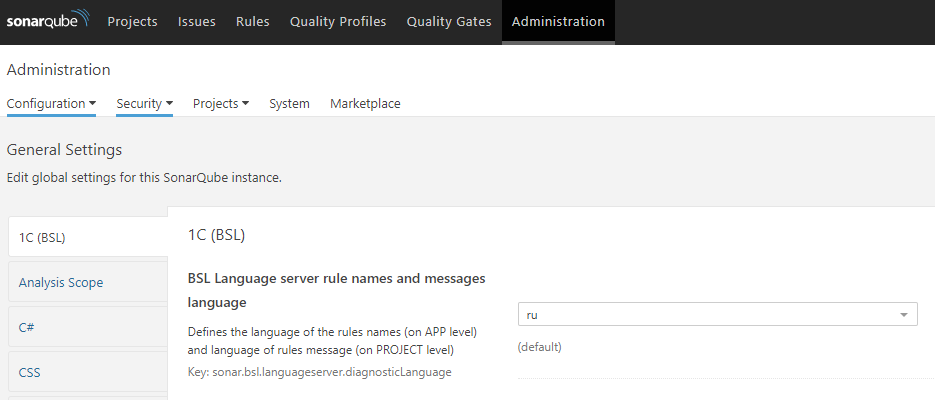
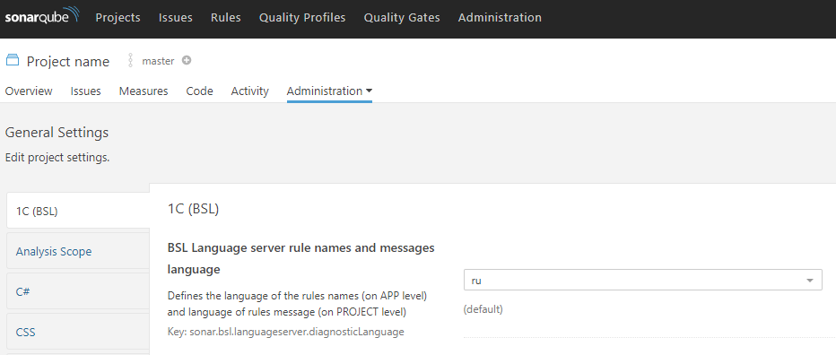

# SonarQube 1C (BSL) Community Plugin

[](https://github.com/1c-syntax/sonar-bsl-plugin-community/actions)
[](https://github.com/1c-syntax/sonar-bsl-plugin-community/releases/latest)
[](https://sonarcloud.io/dashboard?id=1c-syntax_sonar-bsl-plugin-community)
[](https://sonarcloud.io/dashboard?id=1c-syntax_sonar-bsl-plugin-community)
[](https://sonarcloud.io/dashboard?id=1c-syntax_sonar-bsl-plugin-community)
[](https://t.me/bsl_language_server)

1C:Enterprise and OneScript languages support for [SonarQube](http://sonarqube.org).

[Russian version](../index.md)

## Opportunities

- Project "Overview" dashboard;
- Highlighting the source code of 1C: Enterprise;
- Calculation of basic metrics, calculation of the number of lines of code;
- Registration of diagnostics provided by [BSL Language Server](https://1c-syntax.github.io/bsl-language-server) as internal rules; 
- Embedded Analyzer - BSL Language Server Diagnostic provider
- Import results from external analyzers in internal [json](https://1c-syntax.github.io/bsl-language-server/reporters/json.html) format;

## Install and Update

- Download jar file from [releases](https://github.com/1c-syntax/sonar-bsl-plugin-community/releases) page
- Put the jar file according to Manual Installation [section of official documentation](https://docs.sonarqube.org/latest/setup/install-plugin/) (default - `$SONARQUBE_HOME/extensions/plugins`)
- Restart server

## Requirements

SonarQube Version | Plugin Version
------------------|------------------
7.9+              | 0.7.0+
7.4 - 7.8         | 0.1.0...0.6.0

Plugin Version | JAVA Version
---------------|----------------
1.0+           | 11
0.1.0 - 0.6.0  | 8

## Run analysis

### Setting up the environment

The [sonar-scanner](https://docs.sonarqube.org/display/SCAN/Analyzing+with+SonarQube+Scanner) utility is used for analyzing 1C:Enterprise source files.

You must specify the analysis parameters for the utility in one of the following ways:

- as command line arguments using the syntax `-DparameterName=parameterValue`
- using the file `sonar-project.properties` file

An example of the `sonar-project.properties` file :

```properties
# The key of the project. Unique within the SonarQube server
sonar.projectKey=my_project
# The project name displayed in the SonarQube interface. The default value is the project key.
sonar.projectName=My project
# The version of the project
sonar.projectVersion=1.0
 
# The path to the source code. Relative paths are resolved from the sonar-project file.properties
# A slash ("/") is used as a path separator. You can specify multiple directories separated by commas.
sonar.sources=src
 
# Encoding of source files. 
sonar.sourceEncoding=UTF-8

# Filters for inclusion in the analysis. In the example below - only bsl and os files.
sonar.inclusions=**/*.bsl, **/*.os
```

Parameters passing ways may be combined.

If the SonarQube server has enabled the requirement of forced authorization and/or the prohibition of anonymous project analysis, you need to pass an authorization token the sonar-scanner utility, which can be obtained according to the instruction [User guide/User token](https://docs.sonarqube.org/latest/user-guide/user-token/)

### For example

```sh
sonar-scanner -Dsonar.host.url=http://sonar.company.com -Dsonar.login=SONAR_AUTH_TOKEN
```

## Plugin settings

- `sonar.bsl.languageserver.diagnosticLanguage` - the language of the rule names and message text of the triggered rules from the BSL Language Server. Default - `ru` - Russian;
- `sonar.bsl.languageserver.enabled` - use the built-in BSL Language Server Diagnostic provider analyzer when running analysis via `sonar-scanner`. Default - `true` - enabled;
- `sonar.bsl.languageserver.reportPaths` - the path to the report files in the internal format to the BSL Language Server - `json`. By default - `""` - not filled.
- `sonar.bsl.languageserver.skipSupport` - skip computing diagnostics according to module's support mode. *Only if there is a parent configuration*. Available values:
    * with support locked - modules for support with the prohibition of changes will be skipped ("locked");
    * with support - modules on support will be skipped;
    * never *default* - modules are not skipped
- `sonar.bsl.file.suffixes` - list of file suffixes that will be scanned. Default - `.bsl,.os`
- `sonar.bsl.calculateLineCover` - calculate locations for coverage.
## Language switch for rule names/descriptions and issue messages

Plugin contains support of two languages for rule names/descriptions and issue messages:

* russian (default);
* english.

You can switch language by changing the `sonar.bsl.languageserver.diagnosticLanguage` setting, located at "Administration" panel, category `1C (BSL)`.

To change language of **names and descriptions of rules** you should change this setting in **server** "Administration" panel:

http://localhost:9000/admin/settings?category=1c+%28bsl%29



To change language of **issue texts** you should change this setting in **project** "Administration" panel:

http://localhost:9000/project/settings?category=1c+%28bsl%29&id=projectKey



## Integration with BSL Language Server

By default, the built-in diagnostics provider from BSL Language Server is used as the analyzer.

The built-in analyzer can be disabled by setting the `sonar parameter.bsl.language server.enabled` value `false` via command line or settings file.

```sh
sonar-scanner -Dsonar.bsl.languageserver.enabled=false
```

> Disabling the analyzer does not disable the file parsing process. Metrics calculation and syntax highlighting will work regardless of the setting value.

### Import results from external file

[BSL Language Server](https://github.com/1c-syntax/bsl-language-server) can run source code analysis and output a list of detected diagnostics as a JSON file. Instructions for running BSL Language Server in analysis mode are available on the project page.

To import the result to sonar-scanner utility, pass the parameter `sonar.bsl.languageserver.reportPaths` via command-line arguments or via the `sonar-project.properties` file., which specifies the path to the file (or files, separated by commas) with the analysis results.

```sh
sonar-scanner -Dsonar.bsl.languageserver.reportPaths=./bsl-json.json
```

### Calculate loc for cover 

Calculate locations for coverage. Use for correct code coverage when using genericCoverage.xml which contains only covered lines. 

```
sonar.bsl.calculateLineCover=true
sonar.coverageReportPaths=./genericCoverage.xml
```

```xml
<coverage version="1">
    <file path="...\Forms\Form\Ext\Form\Module.bsl">
        <lineToCover lineNumber="25" covered="true"/>
        <lineToCover lineNumber="27" covered="true"/>
    </file>
</coverage>
```
  
