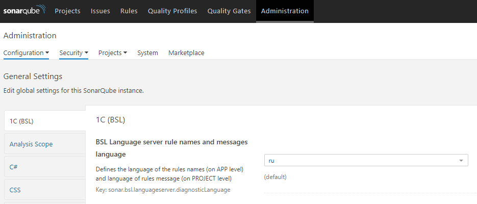

# SonarQube 1C (BSL) Community Plugin

[](https://github.com/1c-syntax/sonar-bsl-plugin-community/actions)
[](https://github.com/1c-syntax/sonar-bsl-plugin-community/releases/latest)
[](https://sonarcloud.io/dashboard?id=1c-syntax_sonar-bsl-plugin-community)
[](https://sonarcloud.io/dashboard?id=1c-syntax_sonar-bsl-plugin-community)
[](https://sonarcloud.io/dashboard?id=1c-syntax_sonar-bsl-plugin-community)
[](https://t.me/bsl_language_server)

Поддержка языка 1С:Предприятие 8 и OneScript для [SonarQube](http://sonarqube.org).

[English version](en/index.md)

## Возможности

* Project "Overview" dashboard;
* Подсветка исходного кода 1С:Предприятие;
* Расчет базовых метрик, расчет количества строк кода;
* Регистрация диагностик, предоставляемых [BSL Language Server](https://1c-syntax.github.io/bsl-language-server) как внутренних правил;
* Встроенный анализатор - BSL Language Server Diagnostic provider 
* Импорт результатов внешних анализаторов во внутреннем формате [json](https://1c-syntax.github.io/bsl-language-server/reporters/json.html);

## Установка и обновление

* Скачать jar-файл со страницы [релизов](https://github.com/1c-syntax/sonar-bsl-plugin-community/releases)
* Разместить jar-файл согласно разделу Manual Installation [официальной документации](https://docs.sonarqube.org/latest/setup/install-plugin/) (по умолчанию - каталог `$SONARQUBE_HOME/extensions/plugins`)
* Перезапустить сервер

## Требования

Версия SonarQube | Версия плагина
-----------------|----------------
7.9+             | 0.7.0+
7.4 - 7.8        | 0.1.0...0.6.0

Версия плагина | Версия JAVA
---------------|------------------
1.0+           | 11
0.1.0 - 0.6.0  | 8

## Запуск анализа

### Настройка окружения

Для анализа исходных кодов 1С используется утилита [sonar-scanner](https://docs.sonarqube.org/display/SCAN/Analyzing+with+SonarQube+Scanner).

Утилите неоходимо указать параметры анализа одним из нижеперечисленных способов:
* в качестве аргументов командной строки, используя синтаксис -DимяПараметра=значениеПараметра
* используя файл `sonar-project.properties`

Пример файла `sonar-project.properties`:

```properties
# Ключ проекта. Уникальный в пределах сервера SonarQube
sonar.projectKey=my_project
# Имя проекта, отображаемое в интерфейсе SonarQube. Значение по умолчанию - ключ проекта.
sonar.projectName=My project
# Версия проекта
sonar.projectVersion=1.0
 
# Путь к исходным кодам. Относительные пути разрешаются от файла sonar-project.properties
# В качестве разделителя пути используется прямой слэш - /. Можно указать несколько каталогов через запятую.
sonar.sources=src
 
# Кодировка файлов исходных кодов.
sonar.sourceEncoding=UTF-8

# Фильтры на включение в анализ. В примере ниже - только bsl и os файлы.
sonar.inclusions=**/*.bsl, **/*.os
```

Способы передачи параметров можно комбинировать.

Если на сервере SonarQube включено требование принудительной авторизации и/или запрет анонимного анализа проектов, утилите sonar-scanner дополнительно нужно передавать токен авторизации, который можно получить согласно инструкции [User guide/User token](https://docs.sonarqube.org/latest/user-guide/user-token/)

### Пример строки запуска

```sh
sonar-scanner -Dsonar.host.url=http://sonar.company.com -Dsonar.login=SONAR_AUTH_TOKEN
```

## Настройки плагина

* `sonar.bsl.languageserver.diagnosticLanguage` - язык имен правил и текстов сообщений сработавших правил от BSL Language Server. По умолчанию - `ru` - русский;
* `sonar.bsl.languageserver.enabled` - использование встроенного анализатора BSL Language Server Diagnostic provider при запуске анализа через `sonar-scanner`. По умолчанию - `true` - включен;
* `sonar.bsl.languageserver.reportPaths` - путь к файлам отчетов во внутреннем формате BSL Language Server - `json`. По умолчанию - `""` - не заполнено.
* `sonar.bsl.languageserver.skipSupport` - пропустить расчет диагностик в зависимости от режима поддержки модуля. *Только при наличии конфигурации поставщика*. Доступные значения:
    - with support locked - будут пропускаться модули на поддержке с запретом изменения (*"на замке"*);
    - with support - будут пропускаться модули на поддержке;
    - never *по умолчанию* - модули не пропускаются;
* `sonar.bsl.file.suffixes` - список расширений файлов для анализа. По умолчанию - `.bsl,.os`
* `sonar.bsl.calculateLineCover` - расчитывать строки для покрытия тестами. По умолчанию - `false` - выключен

## Переключение языка имен правил и сообщений в замечаниях

В плагине зашита поддержка двух языков для имен/описаний правил и текстов сообщений в замечаниях:

* русский (по умолчанию);
* английский.

Переключение осуществляется с помощью настройки `sonar.bsl.languageserver.diagnosticLanguage`, расположенной в секции "Администрирование", раздел `1C (BSL)`.

Для переключения языка **имен и описаний правил** данную настройку необходимо устанавливать в разделе "Администрирование" **сервера**:

http://localhost:9000/admin/settings?category=1c+%28bsl%29



Для переключения языка **текстов замечаний** данную настройку необходимо устанавливать в разделе "Администрирование" **проекта**:

http://localhost:9000/project/settings?category=1c+%28bsl%29&id=projectKey


## Интеграция с BSL Language Server

По умолчанию в качестве анализатора используется встроенный провайдер диагностик из BSL Language Server.

Выполнение анализа встроенным анализатором можно отключить, установив параметру `sonar.bsl.languageserver.enabled` значение `false` через командную строку или файл настроек.

```sh
sonar-scanner -Dsonar.bsl.languageserver.enabled=false
```

> Отключение анализатора не отключает процесс парсинга файлов. Расчет метрик и подсветка синтаксиса будут работать вне зависимости от значения настройки.

### Импорт результатов из внешнего файла

[BSL Language Server](https://github.com/1c-syntax/bsl-language-server) может запускать анализ исходного кода и выдавать список обнаруженых диагностик в виде json-файла. Инструкция по запуску BSL Language Server в режиме анализа расположена на странице проекта.

Для импорта результата при запуске утилиты sonar-scanner нужно передать параметр `sonar.bsl.languageserver.reportPaths` через аргументы командной строки или через файл `sonar-project.properties`, в котором указать путь к файлу (или файлам, через запятую) с результатами анализа.

```sh
sonar-scanner -Dsonar.bsl.languageserver.reportPaths=./bsl-json.json
```

### Расчет строк для покрытия тестами

Расчитывает строки которые должны быть покрыты тестами. Используется для корректного подсчета процента покрытия при
 импорте файлов genericCoverage.xml содержащих только покрытые строки.

```
sonar.bsl.calculateLineCover=true
sonar.coverageReportPaths=./genericCoverage.xml
```

```xml
<coverage version="1">
    <file path="...\Forms\Форма\Ext\Form\Module.bsl">
        <lineToCover lineNumber="25" covered="true"/>
        <lineToCover lineNumber="27" covered="true"/>
    </file>
</coverage>
```
  
